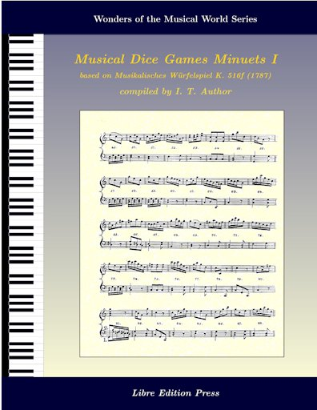

## mdgBookSVGv1

**Here's an opportunity for one to "compose" minuets and to author a Collection Book!!!**

This folder contains materials that allow the user to author a book containing a collection of [Musical Dice Games (MDG)](https://en.wikipedia.org/wiki/Musikalisches_W%C3%BCrfelspiel) minuets, generated based on the rules given in  [*Musikalisches Würfelspiel, K.516f* (Mozart, Wolfgang Amadeus)](http://imslp.org/wiki/Musikalisches_W%C3%BCrfelspiel,_K.516f_(Mozart,_Wolfgang_Amadeus)). 

To download an example of a generated book, simply right-click (then "Save Link As ...") on the following image (Note: TO enable the MIDI audio links to download [mdgBookSVG_1-midi.zip](./mdgBookSVG_1-midi.zip); and unzip on the same directory that contains the book): 

Alternatively, you may download or clone this project and access the book (and `midi` files, among others) from the `res` folder.

## Related Sites
- [Mozart](https://marian-aldenhoevel.de/mozart/) - A site maintained by Marian Aldenh&ouml;vel allows the visitor to generate a MDG (user-specified or randomly-generated) and the corresponding audio (<tt> midi</tt>, <tt>wav</tt>) and image files (<tt>pdf</tt>, <tt>png</tt>) based on *Musikalisches W&uuml;rferspiel, K. 516f*.
- [Opus Infinity](https://opus-infinity.org/) - Collaborative work of Robbert Harms, Hein Moors, and Suus van Petegem whose goal is to unravel the mystery behind the tables used for generating MDGs.  Site visitors can generate MDGs based on works of Kirnberger, Mozart, Stadler/Haydn), and Bach.  Corresponding audio files (<tt>mid</tt>, <tt>ogg</tt>, and/or <tt>mp3</tt>) and image files (<tt>pdf</tt> or <tt>png</tt>) are also made available for listening, viewing, or downloading.
- [Mozart](http://sunsite.univie.ac.at/Mozart/dice/) - A site maintained by John Chuang that allows the site visitor to generate MDGs based on the work of Stadler/Haydn.
- [`mozart.zip`](http://www.amaranthpublishing.com/MozartDiceGame.htm) -  This is a Windows software (&copy; 1995 VisionSoft) by John Chuang and Stephen Goodwin that generates MDG based on input from user and is available for <em> free</em> from  [Amaranth Publishing](http://www.amaranthpublishing.com/MozartDiceGame.htm). 
-  [Mozart - Musical Game in C K. 516f* (http://www.asahi-net.or.jp/\~rb5h-ngc/e/k516f.htm)](http://www.asahi-net.or.jp/\~rb5h-ngc/e/k516f.htm), Mozart Studies Online - The site of Hideo Noguchi that offers an explanation linking <tt> Musikalisches W&uuml;rferspiel, K. 516f</tt> and <tt>K. 294d (K. Anh. C 30.01)</tt>.

## Acknowledgements
My sincerest gratitude to Chris Walshaw et al. for the [ABC music notation](http://www.abcnotation.com);  Jean-Francois Moine for [abcm2ps](http://moinejf.free.fr/) and the accompanying examples, templates, and pointers for the appropriate use of these resources;  Guido Gonzato for the [ABC Plus Project](http://abcplus.sourceforge.net/) and the [abcmidi resources](http://abcplus.sourceforge.net/#abcMIDI) available there, more especially for the ABC resource book *Making Music with ABC 2*; James R. Allwright and Seymour Shlien for [abcmidi](http://abc.sourceforge.net/abcMIDI) source and binaries; [Artifex, Inc.](https://artifex.com) for Ghostscript v.9.06 (includes the `ps2pdf` converter); [Inkscape v.0.48.5](https://www.inkscape.org) for the tool for converting SVGs to PDFs for inclusion into LaTeX documents; and, [<tt>User:Martin H</tt>](https://tex.stackexchange.com/users/632/martin-h) for his [reply](https://tex.stackexchange.com/questions/2099/how-to-include-svg-diagrams-in-latex) to a TeX/LaTeX Stack Exchange question on including SVGs into LaTeX documents.  Special thanks also to the [International Music Score Library Project (IMSLP)](http://imslp.org/) for making available the score for *Musikalisches Würfelspiel, K.516f* and [Amaranth Publishing](http://www.amaranthpublishing.com/MozartDiceGame.htm) for a copy of <tt>mozart.zip</tt>.  Ditto to Machtelt Garrels for the book [Bash Guide for Beginners](http://tldp.org/LDP/Bash-Beginners-Guide/html/Bash-Beginners-Guide.html), Vivek Gite for the book [Linux Script Shell Tutorial](http://www.freeos.com/guides/lsst/), Steve Parker for the [Unix/Linux Shell Cheatsheet](http://steve-parker.org/sh/cheatsheet.pdf).  John Fogarty's GitHub Site: [Latex CreateSpace BookCover](https://github.com/jfogarty/latex-createspace-bookcover) and Peter Wilson's reply in TeX/LaTeX Stack Exchange on [designing a book cover](https://tex.stackexchange.com/questions/17579/how-can-i-design-a-book-cover) were sources of ideas, information, and materials for creating the book cover and title page, thanks to both of them. Many thanks to the [Debian Project](https://www.debian.org) for the Debian 8 (Jessie) GNU/Linux OS, [TeXLive](http://www.tug.org/texlive/) for the TeX distribution, and [GitHub](https://github.org) for its generosity in providing space for [this project](https://github.com/justineuro/mdgBookSVGv1).

## License

  
   
  To the extent possible under law,
  <a rel="dct:publisher"
     href="https://github.com/justineuro/mdgBookSVGv1">
    Justine Leon A. Uro</a>
  has waived all copyright and related or neighboring rights to
  <a href="https://github.com/justineuro/mdgBookSVGv1">mdgBookSVGv1</a>.
This work is published from:

  Philippines.

